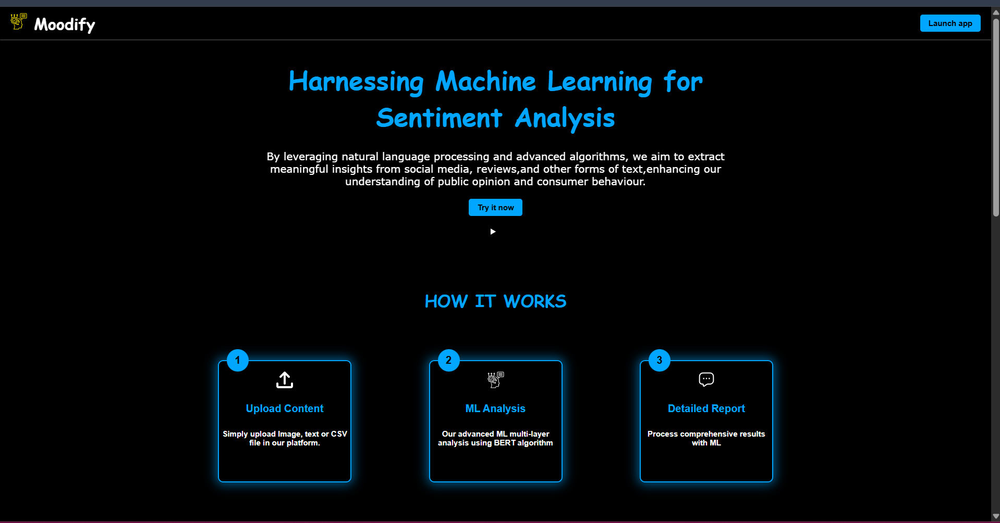
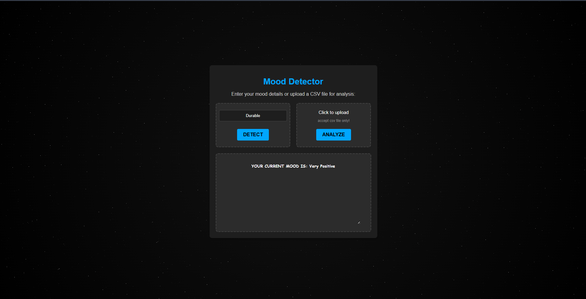
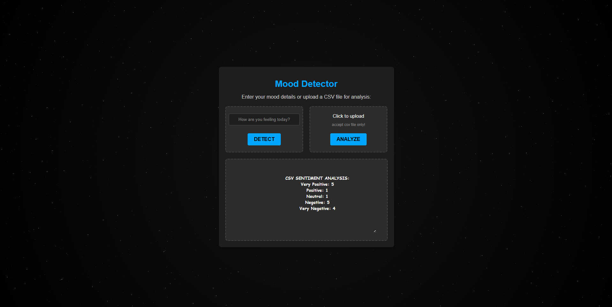

# 💬 Sentiment Analysis Web App using BERT and Flask

This is a **full-stack Machine Learning project** that performs **Sentiment Analysis** on user reviews using a fine-tuned **BERT** model. It offers a simple, interactive web interface where users can input their own text reviews or upload CSV files containing multiple reviews. The application then predicts the **sentiment category** for each input using Natural Language Processing (NLP).

---

## 🧠 Project Overview

Sentiment analysis helps determine the emotional tone behind textual data. This application focuses on classifying reviews related to products, services, or general experiences into five sentiment classes:

- **Very Positive**
- **Positive**
- **Neutral**
- **Negative**
- **Very Negative**

Users can either:
- Enter their reviews manually through the web interface
- Upload a `.csv` file containing multiple reviews for batch analysis

Each review is passed through a BERT model trained to detect nuanced sentiment, delivering high-quality, contextual predictions.

---

## 🖼️ Demo

Here’s a quick look at the Sentiment Analysis Web App in action:

### 🧾 1. Home Page – Enter Review or Upload CSV

---

### 💬 2. Single Review Prediction Result

---

### 📂 3. CSV Upload and Bulk Sentiment Result

---

## 🎯 Key Features

- 🌐 **Interactive Web Interface**  
  Clean frontend built with HTML, CSS, and JavaScript, allowing seamless user interaction.

- 📥 **CSV Upload Support**  
  Upload a CSV file with a list of reviews and get sentiment predictions for each one in tabular format.

- 🧾 **Real-Time Predictions**  
  Single review entries are classified on-the-fly and displayed instantly.

- 🤖 **Fine-Tuned BERT Model**  
  Utilizes the `bert-base-uncased` architecture from HuggingFace, trained on labeled sentiment data to understand context, sarcasm, and polarity.

- 📊 **Five-Level Sentiment Categories**  
  Goes beyond binary classification (positive/negative) to provide **very positive**, **positive**, **neutral**, **negative**, and **very negative** distinctions.

- ☁️ **Model Trained on Google Colab**  
  Model was trained, validated, and saved using GPU acceleration on Google Colab.

---

## 🧰 Technologies Used

| Layer       | Tools / Frameworks                       |
|-------------|-------------------------------------------|
| Frontend    | HTML, CSS, JavaScript                    |
| Backend     | Python, Flask                            |
| ML Model    | BERT (`bert-base-uncased`), PyTorch      |
| Data Handling | Pandas, NumPy                         |
| Model Training | Google Colab, HuggingFace Transformers |
| File Upload | CSV file parsing and batch inference     |

---

## 📑 How It Works

1. **User Input**:  
   - A user enters a single review or uploads a CSV file with multiple reviews.

2. **Preprocessing**:  
   - The input is cleaned and tokenized using the BERT tokenizer.

3. **Model Prediction**:  
   - The preprocessed data is passed through a fine-tuned BERT model to get sentiment predictions.

4. **Output**:  
   - The predicted sentiment label is returned and displayed in a user-friendly format.

---

## 📂 Example Use Cases

- E-commerce platforms analyzing customer reviews.
- Companies processing product feedback.
- Sentiment monitoring for social media campaigns.
- Customer service feedback systems.

---

## 🧪 Model Training Summary

- **Model Base**: `bert-base-uncased`
- **Training Platform**: Google Colab (GPU)
- **Dataset**: Manually prepared or domain-specific dataset with sentiment-labeled reviews
- **Classes**: 5 (Very Negative, Negative, Neutral, Positive, Very Positive)
- **Loss Function**: CrossEntropyLoss
- **Optimizer**: AdamW
- **Validation**: Accuracy, F1-Score, Confusion Matrix

---

## 🧠 Why BERT?

Unlike traditional models, BERT understands **context and semantics** due to its bidirectional training. For example:

- "The product is **unbelievably good**." → Very Positive  
- "The product is **not bad**." → Positive (not Negative)

Such subtle differences are hard to catch with simpler models but are effectively handled by BERT.

---

## 📌 Limitations & Future Scope

- **Does not show prediction confidence** (e.g., 85% positive)
- **Assumes English language input**
- UI can be further enhanced for mobile responsiveness
- Future version may include:
  - Model confidence score display
  - Sentiment trend graphs for uploaded CSVs
  - Login/Signup for saving user analysis history
  - API endpoint for integration into other platforms

---

<!--## 👨‍💻 Developed By

**Shrish Das**  
📍 Computer Science (AI & ML), VIT Bhopal University  
🔗 [LinkedIn](https://www.linkedin.com/in/shrish-das-44ba5a27b)  
📧 shrishdas.cse@gmail.com  
💻 Passionate about ML, Full-Stack Development, and Building Scalable AI Solutions-->

---

## 🌟 Show Your Support

If you found this project helpful or interesting, please ⭐ star this repository and share it with others!

